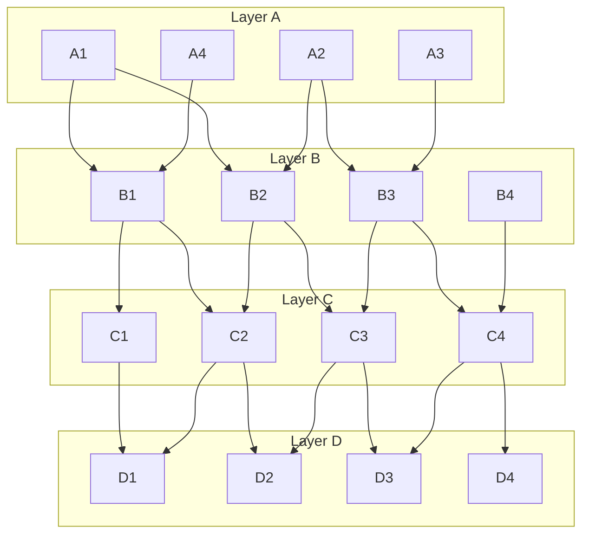

# Open Questions: Remove `variant` as Behavioral Gate (#324)

## Q1: Implementation import traversal

When an implementation (microservice) is loaded, should its own `imports` section also be traversed?

### Answer: No — implementations are leaf nodes (Option A)

The traversal is directional from the initial URN's perspective:

- **Imports = parents (upward)**: "whose requirements do I reference?" → follow recursively
- **Implementations = children (downward)**: "who implements my requirements?" → load annotations/SVCs/tests only

An implementation's own imports point to requirements *outside* the initial URN's parent chain.
Those are a different scope — relevant only if that other system is parsed as its own initial source.

```
initial-source (C1)
  imports/ → recurse upward (parents: B1 → A1, A4)
  implementations/ → load flat, no sub-traversal
    D1 (leaf — provides annotations/SVCs/tests for C1's requirements)
        D1's import of C2 is IRRELEVANT from C1's perspective
```

---

## Discussion Graph

4 layers × 4 nodes for reasoning about traversal scenarios.



Edges are unlabelled — overlay `import` / `implementation` semantics per scenario.

Notable properties:
- **Shared nodes**: B2 (A1+A2), B3 (A2+A3), C2 (B1+B2), C3 (B2+B3), D1 (C1+C2), D2 (C2+C3), D3 (C3+C4)
- **Isolated paths**: A4→B1 (A4 shares B1 with A1 but has no other children); B4→C4 (B4 only reachable if explicitly listed)
- **Diamond patterns**: A1→B1→C2→D2 and A1→B2→C2→D2 (two paths to D2 via C2)

### Scenario 1 — A1 is initial, all edges are `import`

A1 imports B1, B2. B1 imports C1, C2. B2 imports C2, C3. Etc.

- Traversal reaches: B1, B2, C1, C2, C3, D1, D2, D3
- C2 is reached twice (via B1 and B2) — visited-set prevents re-parsing
- **Not reached**: A2, A3, A4, B3, B4, C4, D4

### Scenario 2 — B2 is initial (microservice as initial source)

A microservice CAN have imports — currently it calls `__import_systems` on them.
B2 imports C2, C3. Those recursively import D1, D2, D3.

- Traversal reaches: C2, C3, D1, D2, D3
- B2 has no implementations listed
- **Not reached**: anything in layer A, B1, B3, B4, C1, C4, D4

This scenario confirms microservices import systems and that imports must be followed regardless of who is initial.

### Scenario 3 — A1 is initial, B4 is an `implementation`

A1 imports B1, B2 (→ C1-C3, D1-D3 as in Scenario 1).
A1 also lists B4 as an implementation (microservice implementing A1's requirements).

B4 is loaded as a leaf node:
- B4's annotations/SVCs/tests are checked against A1's (+ parents') requirements
- B4 may also import C4, but that import is irrelevant from A1's perspective
- C4, D4 are not reached — and shouldn't be. They are outside A1's requirement scope.

### Scenario 4 — A2 is initial, B2/B3 are shared with A1's graph

If A2 is parsed after A1 in a multi-root scenario:
- A2 imports B2 (already visited), B3 (new)
- B3 imports C3 (already visited), C4 (new)
- C4 imports D3 (already visited), D4 (new)

Visited-set handles re-entry into already-parsed nodes cleanly.

### Scenario 5 — Cycle

Hypothetical: D1 has an import back to A1.

- Without detection: A1→B1→C1→D1→A1→… infinite
- With visited-set on imports: after A1 is added to visited on first entry, D1→A1 triggers `CircularImportError`
- Same logic applies if the back-edge is via an implementation edge (Q2 scope question)

---

## Q2: Cycle detection scope

Where should circular import detection trigger?

### Answer: Import chain only (Option A)

Cycles can only occur going up the import chain (A imports B imports A).
Implementation edges point downward and are not recursed into, so they cannot form cycles.

---

## Q3: Should reqs, SVCs, MVRs, annotations, and test results be parsed for ALL URNs?

**Answer: Yes — presence-based, regardless of role.**

Current `main` already parses all auxiliary files unconditionally. If a URN provides `svcs.yml`,
it gets parsed whether the URN is the initial source, an import parent, or an implementation child.
The filter processor and reporting layer decide what's relevant for the initial URN's scope.
