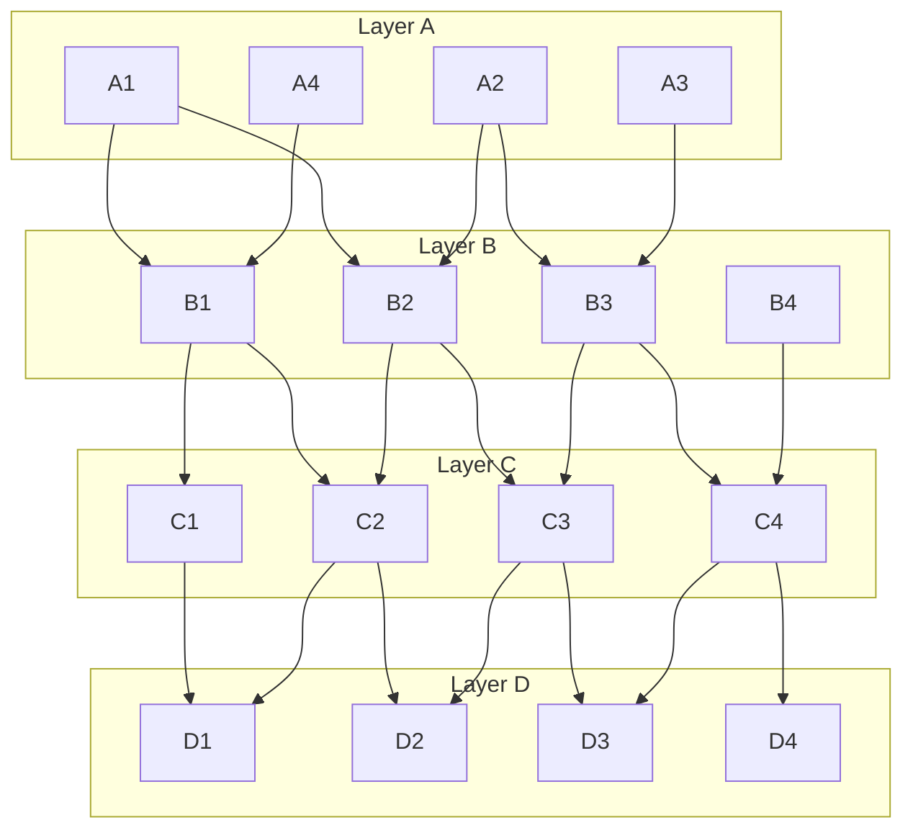

# Open Questions: Remove `variant` as Behavioral Gate (#324)

## Q1: Implementation traversal depth

Should `implementations:` sections be traversed recursively, or are implementation nodes leaves?

### Answer: Recursive (revised — library-uses-library model)

Initial assumption was "leaf nodes" based on a system→microservice mental model. This was revised
after removing `variant` as a behavioral gate.

Think library-uses-library: lib-a can have its own implementations (lib-b → lib-c). All nodes in
the implementation subtree can have annotations and test results pointing to in-scope requirements.
Flat traversal silently misses their evidence.

The one constraint that remains: `imports:` sections of implementation nodes are NOT followed.
An implementation's own imports point to a different requirement scope.

```
initial-source (C1)
  imports/ → recurse upward (parents: B1 → A1, A4) — full insert
  implementations/ → recurse downward (lib-a → lib-b → lib-c) — metadata-only insert
    lib-a's own imports: NOT followed (different scope)
```

---

## Discussion Graph

4 layers × 4 nodes for reasoning about traversal scenarios.



Edges are unlabelled — overlay `import` / `implementation` semantics per scenario.

Notable properties:
- **Shared nodes**: B2 (A1+A2), B3 (A2+A3), C2 (B1+B2), C3 (B2+B3), D1 (C1+C2), D2 (C2+C3), D3 (C3+C4)
- **Isolated paths**: A4→B1 (A4 shares B1 with A1 but has no other children); B4→C4 (B4 only reachable if explicitly listed)
- **Diamond patterns**: A1→B1→C2→D2 and A1→B2→C2→D2 (two paths to D2 via C2)

### Scenario 1 — A1 is initial, all edges are `import`

A1 imports B1, B2. B1 imports C1, C2. B2 imports C2, C3. Etc.

- Traversal reaches: B1, B2, C1, C2, C3, D1, D2, D3
- C2 is reached twice (via B1 and B2) — visited-set prevents re-parsing
- **Not reached**: A2, A3, A4, B3, B4, C4, D4

### Scenario 2 — B2 is initial (microservice as initial source)

A microservice CAN have imports — currently it calls `__import_systems` on them.
B2 imports C2, C3. Those recursively import D1, D2, D3.

- Traversal reaches: C2, C3, D1, D2, D3
- B2 has no implementations listed
- **Not reached**: anything in layer A, B1, B3, B4, C1, C4, D4

This scenario confirms microservices import systems and that imports must be followed regardless of who is initial.

### Scenario 3 — A1 is initial, B4 is an `implementation`

A1 imports B1, B2 (→ C1-C3, D1-D3 as in Scenario 1).
A1 also lists B4 as an implementation (microservice implementing A1's requirements).

B4 is loaded as a leaf node:
- B4's annotations/SVCs/tests are checked against A1's (+ parents') requirements
- B4 may also import C4, but that import is irrelevant from A1's perspective
- C4, D4 are not reached — and shouldn't be. They are outside A1's requirement scope.

### Scenario 4 — A2 is initial, B2/B3 are shared with A1's graph

If A2 is parsed after A1 in a multi-root scenario:
- A2 imports B2 (already visited), B3 (new)
- B3 imports C3 (already visited), C4 (new)
- C4 imports D3 (already visited), D4 (new)

Visited-set handles re-entry into already-parsed nodes cleanly.

### Scenario 5 — Cycle

Hypothetical: D1 has an import back to A1.

- Without detection: A1→B1→C1→D1→A1→… infinite
- With visited-set on imports: after A1 is added to visited on first entry, D1→A1 triggers `CircularImportError`
- Same logic applies if the back-edge is via an implementation edge (Q2 scope question)

---

## Q2: Cycle detection scope

Where should circular dependency detection trigger?

### Answer: Both import and implementation chains (revised)

Originally: import chain only, since implementations were leaves.

After revising Q1 to recursive implementations: implementation chains can also cycle
(lib-a → lib-b → lib-a). Both chains need independent visited sets and raise distinct errors:

- `CircularImportError` — detected in `__import_systems`
- `CircularImplementationError` — detected in `__import_implementations`

---

## Q3: Should reqs, SVCs, MVRs, annotations, and test results be parsed for ALL URNs?

**Answer: Yes — presence-based, regardless of role.**

All auxiliary files are parsed for every node based purely on file presence. The insertion rules
differ by phase (see Q4), but parsing always runs — including validation.

---

## Q4: What data is inserted for implementation children?

**Answer: Metadata only for requirements; all other files via FK-scoped insert.**

| File | Import parent | Implementation child |
|------|--------------|----------------------|
| `requirements.yml` | full insert | metadata only (skip `insert_requirement`) |
| `svcs.yml` | full insert | insert — FK rejects rows referencing out-of-scope requirements |
| `mvrs.yml` | full insert | insert — FK rejects rows referencing out-of-scope SVCs |
| `annotations.yml` | full insert | insert — FK rejects rows referencing out-of-scope requirements |
| test results | full insert | insert with explicit scope check (no FK, keyed by FQN) |

Validation still runs on `requirements.yml` for all nodes. Syntax errors in an implementation
child's file still surface — only the DB insertion is skipped.

---

## Q5: How are implementation-child requirements excluded from the final scope?

**Answer: Post-parse DELETE in `DatabaseFilterProcessor`.**

`_remove_implementation_requirements()` runs at the start of `apply_filters()`:

```sql
DELETE FROM requirements WHERE urn IN (
    SELECT DISTINCT child_urn FROM parsing_graph WHERE edge_type = 'implementation'
    EXCEPT
    SELECT DISTINCT child_urn FROM parsing_graph WHERE edge_type = 'import'
    EXCEPT
    SELECT value FROM metadata WHERE key = 'initial_urn'
)
```

CASCADE handles SVCs/MVRs/annotations that only linked to those deleted requirements.
Evidence rows linking to in-scope requirements (from Phase 1) survive.

---

## Q6: Why post-parse and not ingest-time?

**Answer: ~30 lines vs ~150 lines; identical result for an ephemeral in-memory DB.**

Ingest-time filtering would require restructuring `CombinedRawDatasetsGenerator` into two explicit
phases with scope-aware population logic (~150 lines across 3–4 files). Post-parse is a single SQL
DELETE in the filter processor (~30 lines). The filter processor already runs a post-parse cleanup
pass for user-defined `filters:` blocks — adding structural cleanup there is consistent.

Since the DB is in-memory and ephemeral (never persisted), the transient presence of
implementation-child requirements has no observable effect beyond the filter step.
